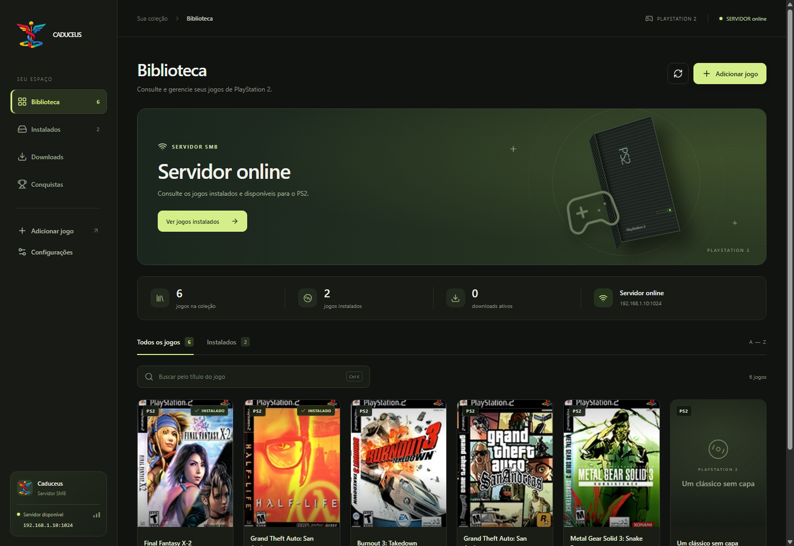
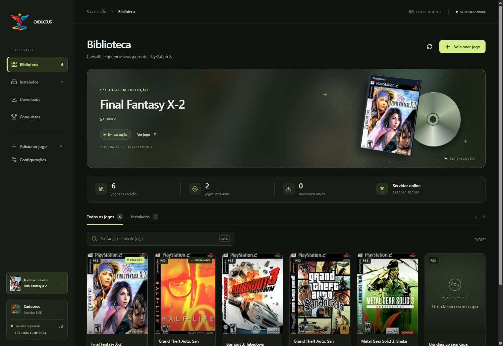
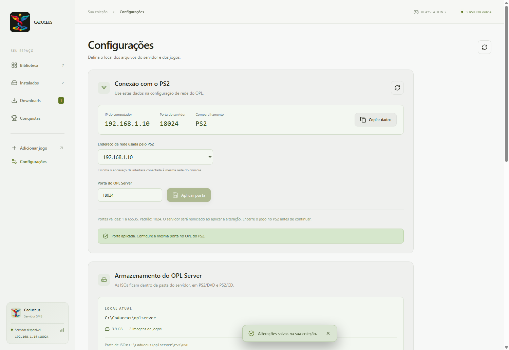

<p align="center">
  
</p>

# Caduceus

**Um app para jogar PS2 pela rede de forma rápida e prática.**

O Caduceus transforma seu computador em um servidor de jogos para o PlayStation 2. Você organiza suas ISOs no Windows e acessa os jogos pelo OPL Caduceus no console, usando a rede local.

O aplicativo reúne o servidor, a biblioteca e as configurações de conexão em uma interface só. Adicione seus jogos, conecte o PS2 por cabo de rede e use os dados exibidos no app para configurar o OPL Caduceus.

Para servir os jogos, usamos o **[OPLServer, do projeto OPL-Server de elmariolo](https://github.com/elmariolo/OPL-Server)**. Para as conquistas ao vivo, incorporamos uma adaptação do **[xeRAbora, de hacan359](https://github.com/hacan359/xerabora)**. O Caduceus reúne esses componentes com sua própria interface e biblioteca.

**[Baixar Caduceus para Windows](https://github.com/Rian6/caduceus/releases/download/v1.2.0/Caduceus-Setup-1.2.0-x64.exe)**

[Versão 1.2.0 · Windows x64 · Notas da versão](https://github.com/Rian6/caduceus/releases/tag/v1.2.0)



## Como funciona

As ISOs ficam no computador. O **[OPLServer](https://github.com/elmariolo/OPL-Server)** disponibiliza esses arquivos por SMB, e o **[OPL Caduceus](https://github.com/Rian6/caduceus-opl)** no PS2 carrega o jogo. São componentes com funções diferentes: o servidor roda no Windows e o carregador roda no console.

```text
Computador: Caduceus + OPLServer + suas ISOs
                 │
             Rede local
                 │
          PlayStation 2 com OPL
```

O computador precisa permanecer ligado e com o aplicativo aberto durante a partida. A conexão serve para carregar os jogos pela rede local; ela não adiciona multiplayer online aos jogos.

## Comece a jogar

Você precisa de um computador Windows, um PS2 com o OPL Caduceus instalado e uma conexão Ethernet entre o console e sua rede.

1. **Instale o Caduceus.** Baixe o instalador acima e abra o aplicativo.
2. **Adicione seus jogos.** Cadastre um título e importe sua ISO. Os arquivos prontos para uso aparecem em **Instalados**.
3. **Conecte o PS2.** Use um cabo de rede e mantenha o console e o computador na mesma rede.
4. **Confira a conexão.** Em **Configurações → Conexão com o PS2**, veja se o servidor está online e anote o IP e a porta.
5. **Configure o OPL.** Preencha os dados do servidor SMB no console e use **`PS2`** como nome do compartilhamento.
6. **Escolha um jogo.** Atualize a lista de jogos por rede no OPL e inicie a partida.

O app inclui um tutorial na primeira abertura. Você pode consultá-lo novamente em **Configurações → Primeiros passos**.

O OPL Caduceus precisa estar instalado no console antes desse processo. Baixe os arquivos e consulte as instruções no [repositório do OPL Caduceus](https://github.com/Rian6/caduceus-opl). O instalador do Caduceus para Windows não inclui o carregador nem jogos.

## Sua biblioteca no computador

Encontre e organize os jogos sem precisar trabalhar diretamente com as pastas do servidor.

- **Biblioteca com capas:** pesquise por título, consulte detalhes e edite os dados dos jogos.
- **ISOs locais:** importe arquivos do computador para a pasta usada pelo OPLServer.
- **Downloads:** acompanhe as transferências dos links cadastrados nos jogos.
- **Jogos instalados:** confira quais imagens já estão disponíveis para o PS2.
- **Jogo em execução:** acompanhe o título detectado, com sua capa, no painel do aplicativo.



## Servidor e armazenamento

O instalador inclui o OPLServer e suas dependências. O Caduceus inicia esse componente e configura a pasta compartilhada e a porta. Nas configurações, você encontra o IP do computador, a porta e o nome do compartilhamento para preencher no OPL.

A porta padrão é **1024** e pode ser alterada. Sempre use a mesma porta no aplicativo e no console.

Você também pode escolher onde guardar os jogos. Por padrão, a estrutura fica em `Documentos/Caduceus/oplserver`, com as imagens dentro de `PS2/DVD` e `PS2/CD`.

Ao escolher outro local, o app oferece duas opções:

- **Migrar a pasta inteira:** transfere jogos, capas, configurações e cartões de memória virtuais.
- **Excluir a pasta antiga e criar uma nova:** começa sem arquivos no destino e apaga o conteúdo anterior após confirmação. Isso inclui saves guardados em VMCs.

Encerre a partida e aguarde as transferências terminarem antes de mudar a pasta ou a porta.



## Catálogo e backup

A biblioteca usa um banco **SQLite local**. Você pode importar uma base JSON ou SQLite e salvar um backup em **Configurações → Base de jogos**.

A importação preserva os registros que já existem. Para experimentar o formato, há um [catálogo JSON de demonstração](examples/jogos-teste.json).

O backup guarda os dados do catálogo, como títulos, endereços das capas e links de download. **ISOs, arquivos de capas, saves, credenciais e configurações não fazem parte desse backup.** Importar uma base também não instala os jogos.

## Recursos extras

### Conquistas RetroAchievements

A aba **Conquistas** permite consultar os jogos e o progresso da sua conta, abrir os detalhes das conquistas e filtrar as desbloqueadas ou pendentes.

Para conectar, informe usuário, senha e Web API Key, disponível nas [configurações do RetroAchievements](https://retroachievements.org/settings). A senha não é salva; o token e a chave ficam protegidos pelo Windows.

As conquistas ao vivo usam o **[xeRAbora](https://github.com/hacan359/xerabora)** em conjunto com o **[OPL Caduceus](https://github.com/Rian6/caduceus-opl)**. O carregador envia a telemetria do PS2 ao componente xeRAbora no computador, que processa as conquistas e se comunica com o RetroAchievements. O Caduceus apresenta os eventos em sua própria interface, com notificações e som.

Incluímos um adaptador baseado no **xeRAbora v0.1.0-alpha.12**, executado em segundo plano, com controle local e armazenamento do token protegido pelo Windows. As alterações estão documentadas no [patch incorporado](vendor/xerabora/caduceus.patch) e no [guia do componente](vendor/xerabora/README.md). O OPLServer permanece independente, responsável pelo acesso às ISOs pela rede.

Na aba Conquistas, o guia **Como funciona** explica a configuração, e **Som e configuração do PS2** permite salvar o `OPL-RA.ELF`, ajustar o volume e controlar a conexão ao vivo.

**Conquistas ao vivo funcionam apenas em softcore. O recurso pode apresentar falhas de carregamento com jogos via SMB.** Para testar as conquistas, use USB ou disco compatível. Para jogar normalmente pela rede sem conquistas ao vivo, use o OPL Caduceus.

Em **Configurações → Biblioteca → Verificar compatibilidade**, você pode verificar se uma ISO corresponde a um conjunto de conquistas do RetroAchievements. As imagens reconhecidas recebem um selo e podem ser listadas pelo filtro **Com conquistas**. A verificação atual aceita ISO, não BIN ou ZSO.

### Atividade no Discord

Se quiser compartilhar sua partida, conecte sua conta em **Configurações → Discord**. A atividade mostra o jogo, a capa disponível e a última conquista recebida na sessão.

Mantenha o Discord desktop aberto na mesma conta e permita o compartilhamento de atividade nas configurações do Discord. Você pode desativar a integração a qualquer momento.

### Aparência e manutenção

As configurações também permitem alternar entre **modo claro e escuro**, reparar as capas dos jogos instalados e reabrir o tutorial inicial.

## Dúvidas rápidas

**Preciso instalar um banco de dados ou configurar MongoDB?**

Não. O aplicativo cria seu banco local automaticamente e o instalador já inclui os componentes necessários para o uso.

**Os jogos não aparecem no OPL. O que verificar?**

Confira se o servidor está online, se há jogos na aba Instalados e se IP, porta e compartilhamento `PS2` estão corretos no console. O PS2 e o computador precisam estar na mesma rede.

**Posso fechar o Caduceus durante a partida?**

Mantenha o app aberto enquanto joga pela rede. Encerrar ou reiniciar o servidor pode interromper o acesso à ISO; dependendo do jogo, será necessário reiniciar a partida no PS2.

**O aplicativo já vem com jogos ou uma conta conectada?**

Não. A instalação começa sem ISOs, catálogo pessoal ou credenciais.

## Executar o projeto

O Caduceus usa **Electron, React, TypeScript, Vite e SQLite**. Para desenvolver, use Windows, Git e Node.js 22.12 ou superior com npm.

```powershell
git clone https://github.com/Rian6/caduceus.git
cd caduceus
npm ci
npm run dev
```

Para compilar e gerar o instalador:

```powershell
npm run dist
```

O resultado fica em `release/`. A geração não publica arquivos automaticamente. A versão distribuída atualmente não possui assinatura digital de editor.

Os testes estão em `scripts/`. Depois de gerar o pacote, `node scripts/check-release.cjs` verifica a versão, os componentes obrigatórios e a ausência de bancos pessoais, credenciais, caches e ISOs.

<details>
<summary>Configuração da integração Discord para mantenedores</summary>

O Application ID está em `electron/discord-config.ts`. No Discord Developer Portal, habilite **Public Client** e cadastre `http://127.0.0.1:53682/discord/callback` como redirect.

O cliente usa OAuth2 com PKCE e escopo `identify`, sem Client Secret ou token de bot no aplicativo. A atividade é enviada pelo RPC local do Discord desktop.

</details>
