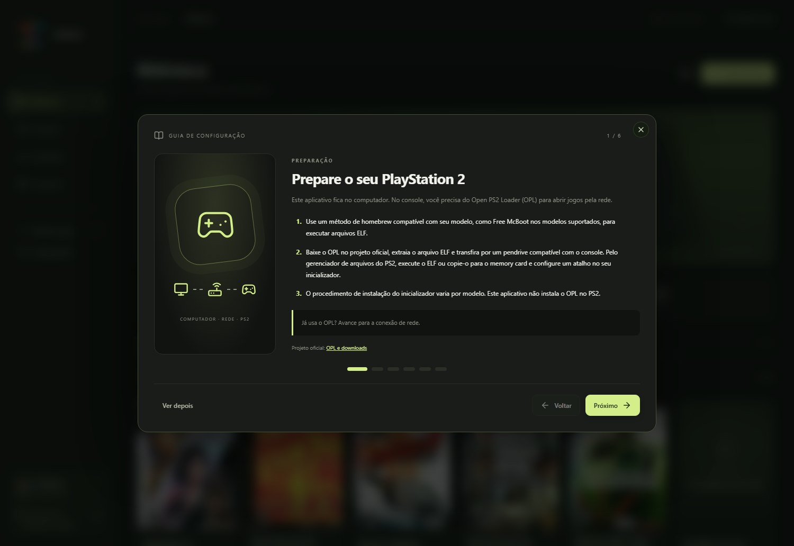
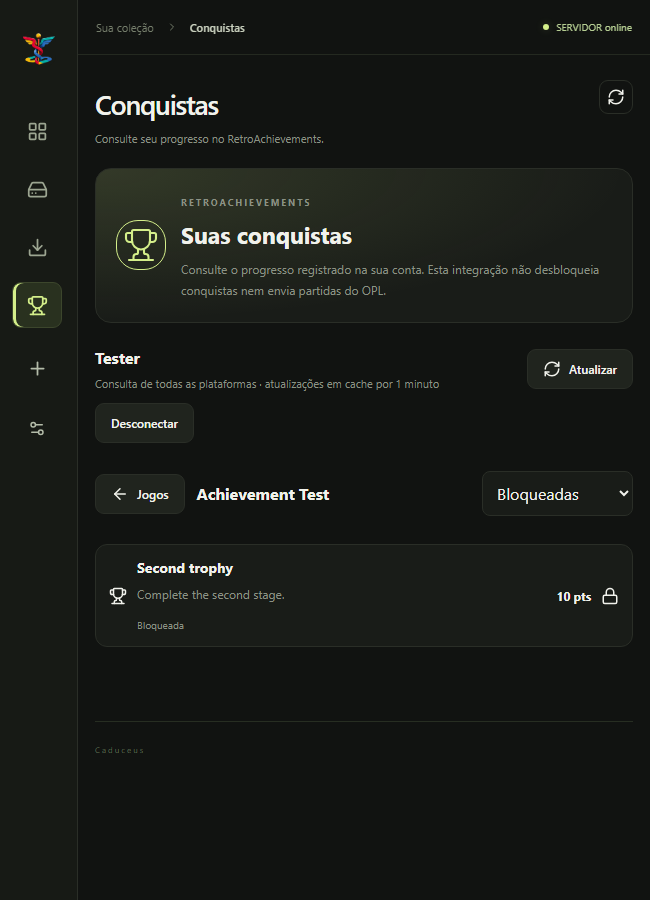

<p align="center">
  
</p>

# Caduceus

Gerenciador de jogos **PlayStation 2 para Windows**, com biblioteca local, downloads, importação de ISOs e servidor integrado para jogar pela rede usando o **Open PS2 Loader (OPL)**.

**Electron · React · TypeScript · Vite · SQLite**


[Recursos](#recursos) · [Primeiros passos](#primeiros-passos) · [Desenvolvimento](#desenvolvimento) · [Conquistas](#conquistas) · [Backup](#catálogo-importação-e-backup)

## Recursos

| Área | O que você pode fazer |
| --- | --- |
| Biblioteca | Buscar jogos, visualizar capas e editar títulos, metadados e opções de download. |
| Instalados | Consultar os arquivos disponíveis no servidor e reparar capas do OPL. |
| Downloads | Acompanhar transferências enquanto navega pelas outras telas. |
| Importação de ISO | Copiar um arquivo do computador para a estrutura do servidor. |
| Servidor | Consultar IP e porta, alterar a porta e escolher onde armazenar os jogos. |
| Armazenamento | Migrar a pasta inteira do OPL Server ou recriá-la em outro local. |
| Catálogo | Importar bases SQLite/JSON e salvar um backup SQLite. |
| Conquistas | Consultar jogos e progresso de uma conta RetroAchievements. |
| Aparência | Alternar entre temas claro e escuro, com a preferência salva. |
| Tutorial | Seguir o guia da primeira abertura ou revê-lo nas configurações. |

Jogos sem capa ou URL continuam na biblioteca. O download fica disponível quando há um link cadastrado.

## Interface

As capturas abaixo mostram a interface com **dados de demonstração**. A conta e as conquistas exibidas no exemplo do RetroAchievements são simuladas.

### Jogo em execução

O destaque da biblioteca acompanha o jogo detectado no servidor, com sua capa e identificação.


### Configurações e tema claro

IP, porta e compartilhamento ficam reunidos para facilitar a configuração do console.


<details>
<summary><strong>Ver o tutorial de primeira abertura</strong></summary>



</details>

<details>
<summary><strong>Ver a aba Conquistas em uma janela compacta</strong></summary>



</details>

## Primeiros passos

Para jogar pela rede, você precisa do Caduceus no computador, do **OPL instalado e funcionando no PS2** e de uma conexão Ethernet entre o console e a rede do computador.

1. Abra o Caduceus e siga o tutorial inicial.
2. Conecte o PS2 e o computador à mesma rede, preferencialmente por cabo ao roteador.
3. Em **Configurações → Conexão com o PS2**, confira se o servidor está online e anote IP, porta e compartilhamento.
4. No OPL, preencha os dados do servidor SMB com os valores exibidos no aplicativo.
5. Importe uma ISO pela edição do jogo ou baixe um arquivo por uma opção cadastrada. Aguarde a conclusão e confira a aba **Instalados**.
6. Abra a lista de jogos por rede no OPL. Mantenha o computador ligado e o Caduceus aberto durante a partida.

O compartilhamento do servidor integrado é `PS2`. Use a porta exibida pelo Caduceus, inclusive se você a tiver alterado. O guia completo pode ser reaberto em **Configurações → Primeiros passos**.

O Caduceus não instala o OPL no console nem inclui ISOs. Consulte o [projeto oficial do OPL](https://github.com/ps2homebrew/Open-PS2-Loader) para os arquivos e orientações do console.

## Desenvolvimento

### Requisitos

- Windows, para executar o servidor e os auxiliares nativos incluídos.
- Node.js compatível com as dependências do projeto e com `node:sqlite` para os scripts de catálogo.
- npm e Git.

Na pasta do projeto:

```powershell
npm ci
npm run dev
```

O comando inicia o Vite, compila o processo Electron e abre o aplicativo. O catálogo local é criado na primeira execução quando necessário; **MongoDB não é obrigatório**.

### Comandos

| Comando | Finalidade |
| --- | --- |
| `npm run dev` | Executar em desenvolvimento. |
| `npm run build` | Compilar a interface e o processo Electron. |
| `npm start` | Abrir o aplicativo usando os arquivos já compilados. |
| `npm run catalog:check` | Validar a presença e consultar os totais do catálogo local. |
| `npm run dist` | Validar o catálogo, compilar e gerar o instalador Windows com electron-builder. |
| `npm run import:mongo` | Importar registros de MongoDB para uma base local existente. |
| `npm run migrate:mongo` | Recriar a base local a partir de MongoDB para uma migração inicial. |

### Instalador

```powershell
npm run dist
```

Prepare o catálogo local antes de gerar o instalador: `database/catalog.sqlite3` é incluído no pacote. Confira quais registros e links deseja distribuir. O computador que recebe o aplicativo instalado não precisa de Node.js, MongoDB ou Python.

## Catálogo, importação e backup

O aplicativo usa **SQLite**. O catálogo guarda títulos, capas, links e outros metadados; as ISOs ficam separadas na pasta do servidor.

| Operação em Configurações → Base de jogos | Comportamento |
| --- | --- |
| Escolher base e importar | Aceita SQLite com tabela `games`, uma lista JSON ou um objeto JSON com a propriedade `games`. |
| Jogos já cadastrados | São ignorados pela importação, preservando os registros locais. |
| Backup automático | É criado antes de gravar uma importação válida. |
| Salvar backup da base | Permite escolher o nome e a pasta de uma cópia SQLite da base atual. |

Para experimentar, use a base de exemplo:

- [jogos-teste.json](examples/jogos-teste.json)

O arquivo contém jogos fictícios, sem ISOs ou links de download. Você também pode gerar uma base SQLite pela opção de backup do aplicativo. Importar um catálogo não instala os jogos. O backup SQLite não inclui ISOs, VMCs ou configurações do aplicativo. Reimportar o backup adiciona registros ausentes; não substitui os registros já existentes.

### Onde os dados ficam

- **Desenvolvimento:** `database/catalog.sqlite3`.
- **Aplicativo instalado:** `catalog.sqlite3` na pasta de dados do usuário gerenciada pelo Electron.
- **Arquivos do servidor:** por padrão, em `Documentos/PS2 Library/oplserver`, com destino alterável nas configurações. O nome histórico da pasta foi mantido.

```text
oplserver/
├── OPLServer.exe
└── PS2/
    ├── DVD/   # Imagens de jogos
    ├── CD/
    ├── ART/   # Capas e arte
    ├── CFG/   # Configurações dos jogos
    └── VMC/   # Cartões de memória virtuais
```

Ao mudar o armazenamento, a opção de migração transfere a pasta inteira. A opção de recriação **exclui o conteúdo antigo após confirmação**, incluindo saves armazenados em VMCs.

### MongoDB opcional

Os scripts de importação usam, por padrão, `mongodb://localhost:27017`, banco `romsfun` e coleção `jogos`. Você pode configurar `MONGO_URI`, `MONGO_DATABASE` e `MONGO_COLLECTION` no ambiente.

Prefira `npm run import:mongo` para incorporar dados a uma base existente. `npm run migrate:mongo` recria o catálogo local. O aplicativo não consulta MongoDB durante o uso normal.

## Conquistas

A aba **Conquistas** usa a API do RetroAchievements para consultar o progresso da conta em todas as plataformas:

- Lista paginada de jogos e progresso normal/hardcore.
- Detalhes, descrições e pontos de cada conquista.
- Filtros de conquistas bloqueadas, desbloqueadas e hardcore.
- Cache de consultas por um minuto.

Informe seu usuário e sua **Web API Key** na própria aba. A chave fica somente na memória durante a sessão e é descartada ao desconectar ou fechar o aplicativo. Não use a senha da conta nesse campo.

A integração é **somente de leitura**: não desbloqueia conquistas nem envia partidas do OPL ao RetroAchievements.

## Organização do projeto

```text
electron/       Processo principal, SQLite, servidor, IPC e integrações
electron/native/ Auxiliares Windows para detectar atividade do OPL
src/            Interface React, componentes e estilos
oplserver/      Componentes do servidor integrado
scripts/        Migração, validação e testes
examples/       Catálogos de demonstração
assets/         Recursos visuais do aplicativo
docs/images/    Capturas usadas neste README
```

### Verificações

```powershell
npx tsc -p tsconfig.json --noEmit
npm run build
```

Há verificações específicas em `scripts/test-*.cjs` para catálogo, backups, armazenamento, rede, RetroAchievements e interface. Os testes de interface usam Electron; os testes de integração com APIs utilizam dados simulados. Não precisam da sua chave RetroAchievements.

## Conteúdo e componentes de terceiros

O Caduceus gerencia os arquivos e metadados adicionados pelo usuário. Jogos, capas e componentes integrados permanecem sujeitos aos direitos e licenças dos respectivos autores. OPL e RetroAchievements são projetos independentes.
